import {Steps} from "nextra/components"

# Linha do Tempo

<Steps>
## 1910

Em 26 de maio de 1910, nasceu Imi Lichtenfeld (Z”L), o criador do Krav Maga, em Budapeste.

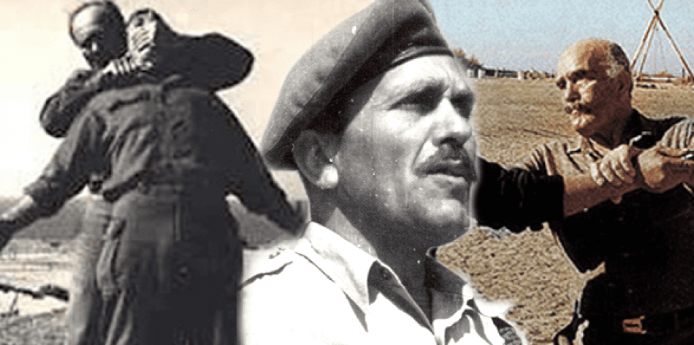

## 1942

Foi criado o Krav Maga, na região conhecida hoje como Israel.
Na época, Imi se juntou ao grupo Haganá, que lutava pela proteção da comunidade judaica local e pela independência do país e, nesse contexto, criou o Krav Maga.

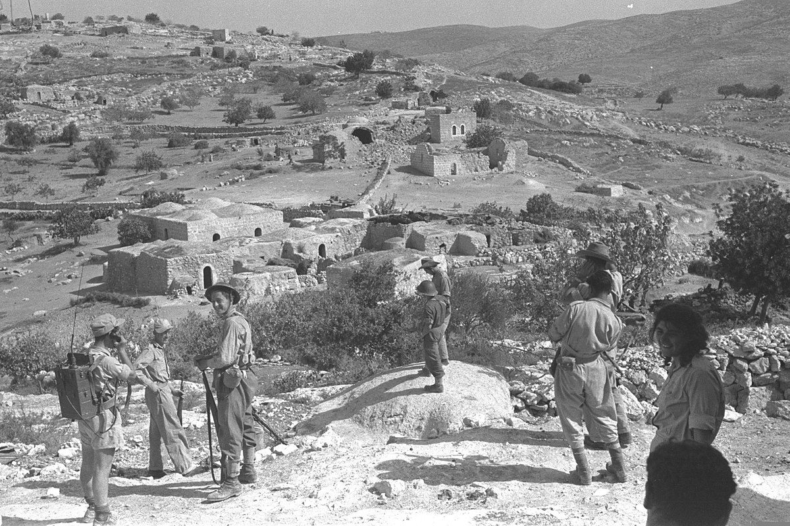

## 1948

Independência de Israel. Neste momento, o Krav Maga foi avaliado, testado e então adotado como a única filosofia de defesa das Forças de Defesa de Israel (IDF), como é até hoje. Assim, Imi se tornou instrutor chefe de preparo físico e defesa pessoal do exército israelense.

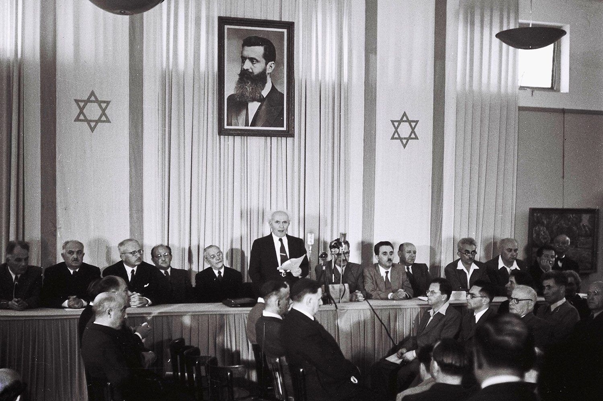

## 1963/64

O ensino do Krav Maga foi aberto à população civil. Até este momento, as suas técnicas eram restritas às tropas de elite do exército israelense.

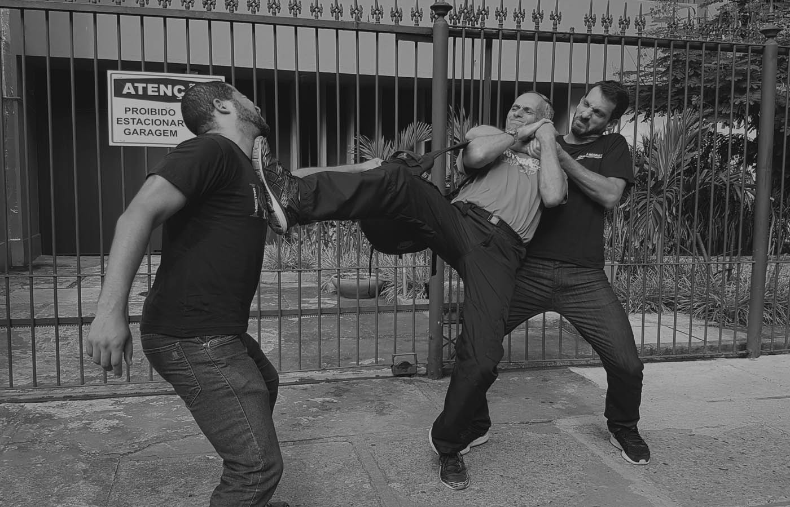

## 1964

Em 31 de julho de 1964, nasceu Kobi Lichtenstein, em Rehovot, Israel.

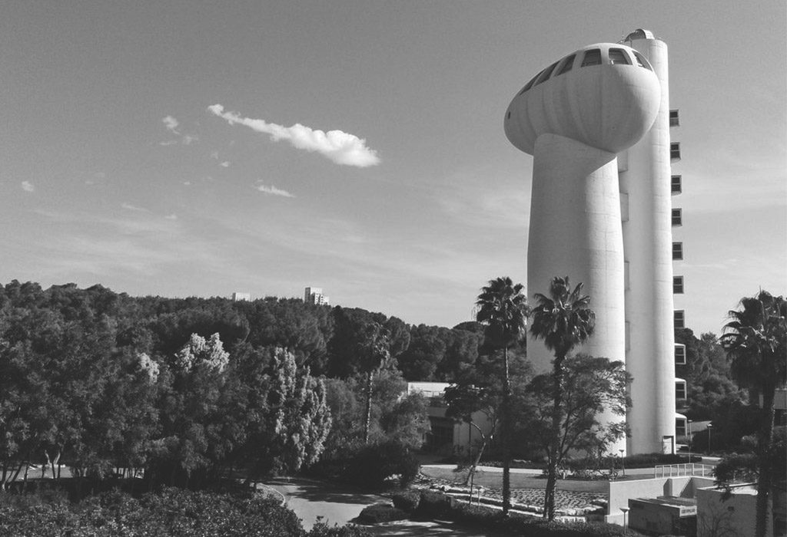

## 1968

Kobi começou a treinar Krav Maga com Imi, o criador do Krav Maga.

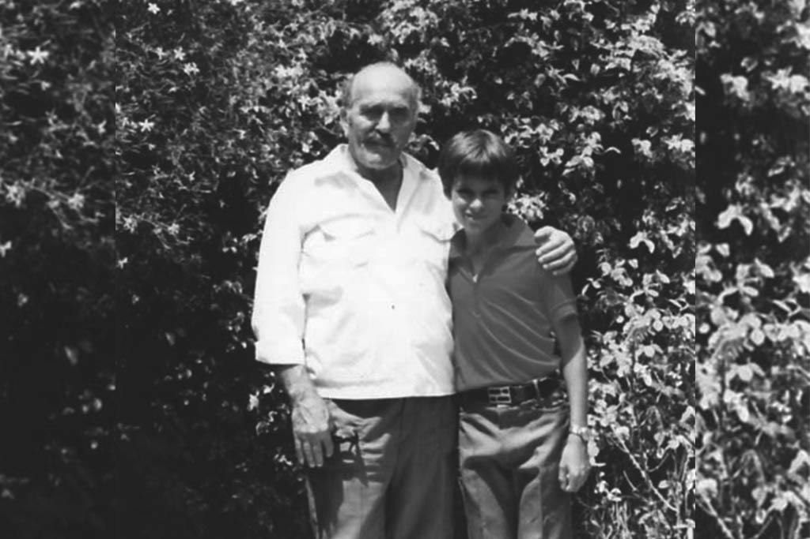

## 1971

Imi entregou a primeira faixa preta para Eli Avigzar e realizou o primeiro curso de instrutores.

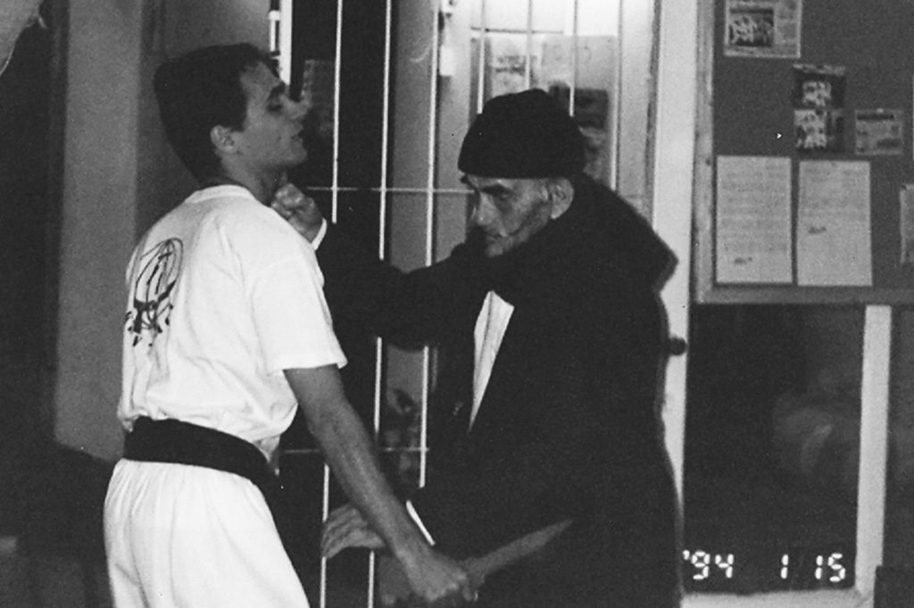

## 1978

Foi fundada a Associação de Krav Maga Israelense.

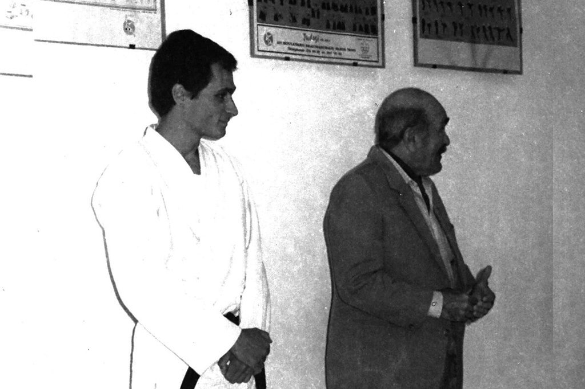

## 1990

Em 18 de janeiro de 1990, o Grão Mestre Kobi introduziu o Krav Maga na América Latina, com a orientação e bênção de Imi. Atualmente, este dia é reconhecido, por lei, como o dia nacional do Krav Maga no Brasil.

  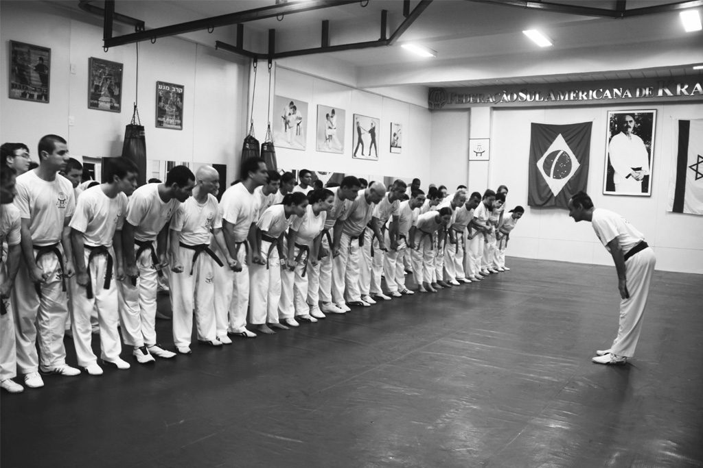

## 1991

Inauguração da Top Defense, o primeiro centro de Krav Maga da América Latina, no Rio de Janeiro.

  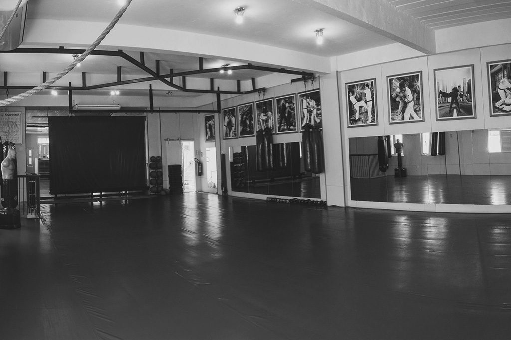

## 1993

3 acontecimentos importantes marcaram este ano:

- Primeiro curso de instrutores da América Latina.
- Registro da marca Krav Maga, pela Top Defense.
- Lançamento do primeiro livro do Grão Mestre Kobi.

  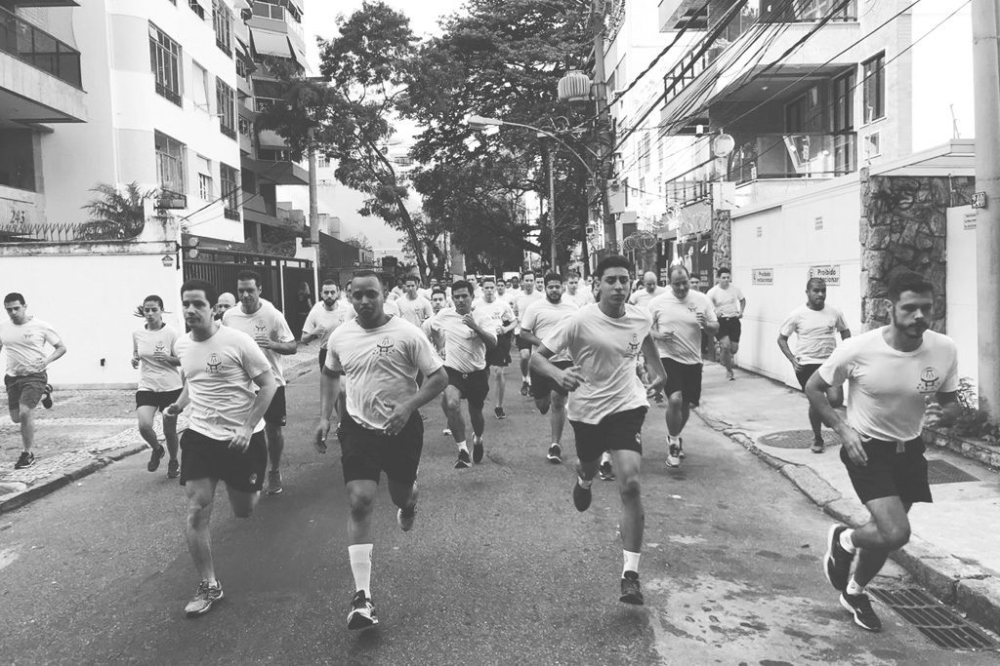

## 1998

Falecimento do criador do Krav Maga, Imi Lichtenfeld (Z”L)

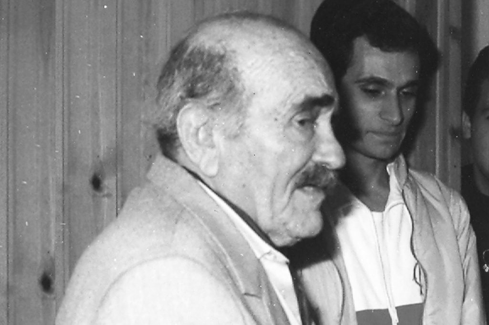

## 2000

Grão Mestre Kobi formou os seus primeiros faixas pretas.

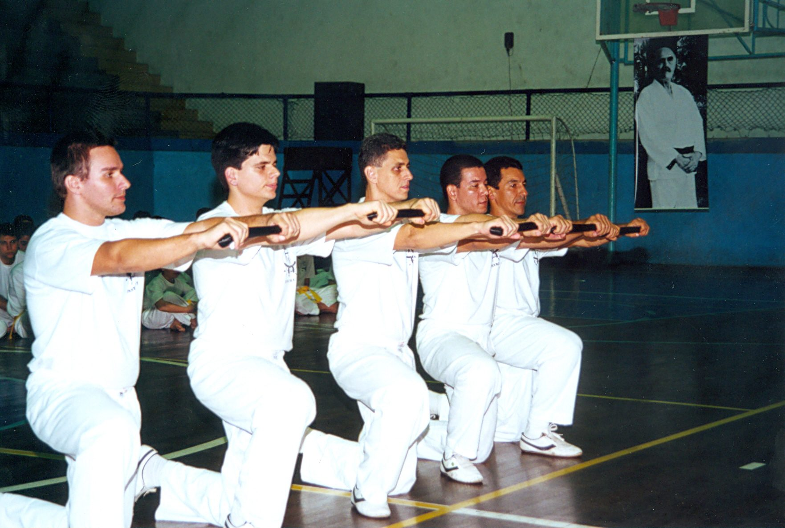

## 2010

"Krav Maga 2010" - o maior evento de Krav Maga da história, reunindo os grandes mestres de Krav Maga mundiais e delegações de 28 países, através de seminários, palestras, workshops, eventos culturais e noite de homenagens. Tudo isso ficou registrado no livro dos recordes Guinness, com a maior aula de defesa pessoal da história, realizada pelo Grão Mestre Kobi nas areias de Copacabana.

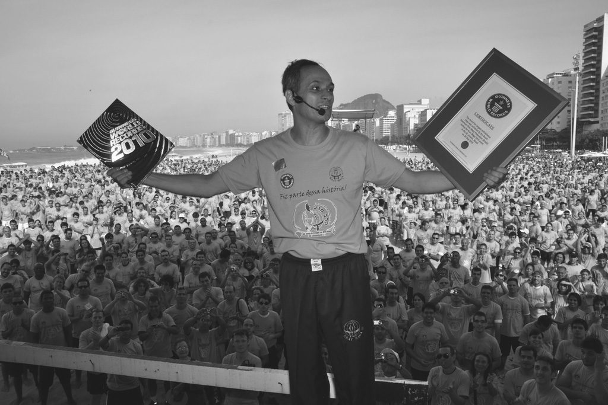

## 2018

Grão Mestre Kobi completou 50 anos de Krav Maga

  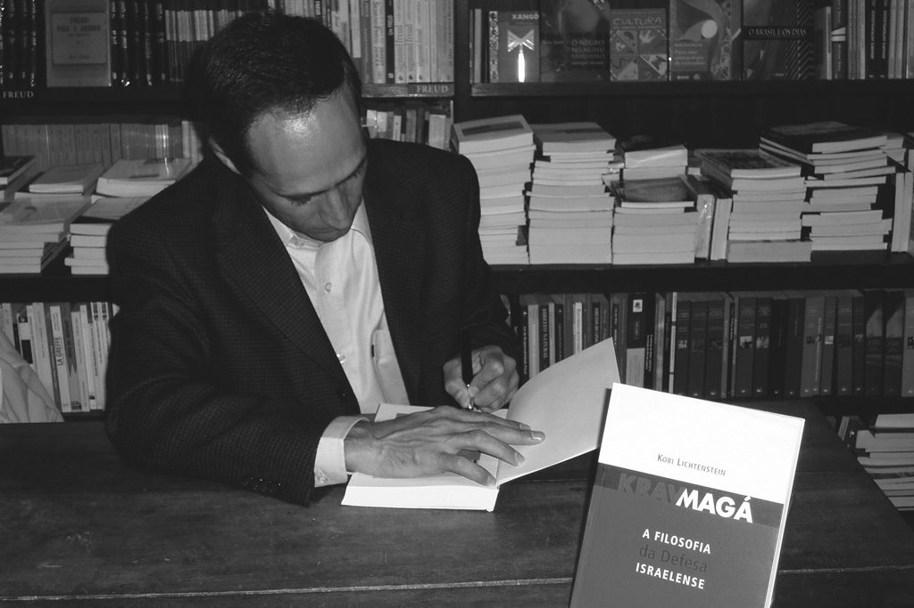

</Steps>
