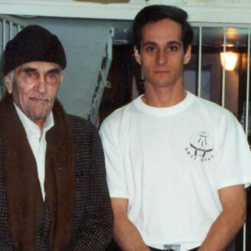
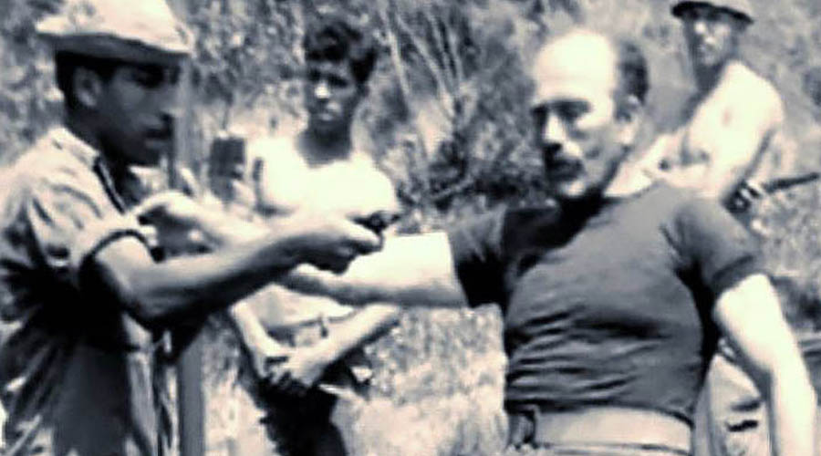
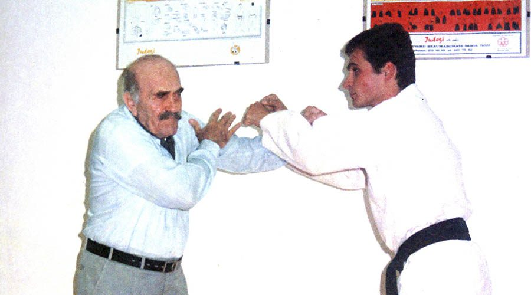

# História

## Quem, Onde e Por Que foi criado o Krav Maga

Década de 1940: guerra, violência e morte. Era urgente o surgimento de um meio de se manter vivo. Os mais fortes, com um pouco de sorte, sobreviviam, os outros não.

E foi a partir desta necessidade de lutar pela vida que um homem, Imi Lichtenfeld (Z”L), criou um método para sobreviver em meio a todo aquele horror. Percebeu que todas as técnicas de combates e lutas existentes de nada valiam diante daquela realidade. E tendo como ferramenta apenas seu próprio corpo, como que iluminado, percebeu que esta “ferramenta” poderia ser muito poderosa; entendeu que seus movimentos naturais poderiam ser trabalhados para a defesa própria e combate e que os seus pontos fracos e sensíveis também o eram para seus inimigos e adversários, afinal, o corpo humano é o mesmo.

Com esta conclusão, criou uma técnica corporal e espiritual que seria eficiente para qualquer um, independente de força ou preparo físico, idade ou sexo: defender sua vida com aquilo que possuía, sua mente e seu corpo.

Em meados de 1940, nasceu o Krav Maga pelas mãos de Imi Lichtenfeld (Z”L) em Israel, pouco antes de sua independência. Um caminho de vida para o homem dos novos tempos, que traz soluções para qualquer tipo de violência, seja ela armada ou desarmada, contra um ou vários agressores e até mesmo contra ataques terroristas e situações com reféns.

Em 1948, com a independência do Estado de Israel, o Krav Maga tornou-se a única filosofia de defesa adotada pelo Tzahal, Forças de Defesa de Israel (IDF), polícia e serviço secreto. Na verdade, o nome Krav Maga surgiu em meados de 1950, sendo chamado até então simplesmente de defesa pessoal, ou ainda de defesa pessoal de Imi. Inicialmente, suas técnicas eram restritas apenas à elite militar israelense, mas a partir de 1964 foi liberado o ensino aos militares em geral e à população civil dentro do Estado de Israel.

Foi nesse momento que seu criador abriu 2 academias, uma em Netanya e outra em Tel Aviv, com a intenção de começar a ensinar a população civil as suas técnicas. E então, no início de 1968, aparece na academia de Tel Aviv uma criança, de apenas 3 anos de idade, para começar a treinar Krav Maga. Seu nome? Kobi Lichtenstein.

Contudo, a turma não era infantil e a pequena criança ficaria apenas para algumas aulas de experiência, a fim de entender que aquilo ainda não era para ele. Entretanto, esse período de experiência se estendeu, e se estendeu, e se estendeu mais ainda. Hoje, Mestre Kobi já tem mais de 50 anos de Krav Maga.

  

  

    Em 1971, Imi entrega a primeira faixa preta a Eli Avigzar e realiza o primeiro curso de instrutores. Em 1978, funda
    a Associação de Krav Maga Israelense. Então, chega a década de 80 e Imi, com a preocupação de dar continuidade à sua
    obra, transmitindo-a para o resto do mundo e para as próximas gerações, decide selecionar um pequeno grupo que seria
    treinado e preparado para este fim, do qual o Mestre Kobi é parte integrante. Em 1987, foi liberado o ensino do Krav
    Maga fora de Israel.
  

Assim sendo, em 1990, o primeiro faixa preta sai de Israel para difundir o Krav Maga: Mestre Kobi chega ao Brasil, como o único representante da arte na América Latina.

No ano seguinte, abre a 1ª academia de Krav Maga do continente, a Top Defense, que hoje é a sede oficial da Federação Sul Americana de Krav Maga. E assim começou o Krav Maga nesse canto do mundo.

Aos poucos, o número de alunos foi crescendo e então veio o 1º curso de instrutores, em 1993. Em 2000, os primeiros faixas pretas. E em 2010, realizamos a maior aula de defesa pessoal da história, entrando para o Guinness, o livro dos recordes mundiais. Hoje, temos o orgulho de dizer que somos a maior Federação de Krav Maga do mundo.

## A criação do Krav Maga:

Por que por Imi, por que em Israel?

O surgimento do Krav Maga foi o resultado natural da fusão de duas histórias: a história de Imi, o criador do Krav Maga, e a história do Estado de Israel.

Desde muito pequeno, no âmbito familiar, Imi aprendeu a importância de ser atuante na sociedade. Seu pai, detetive dedicado, instrutor de combate da polícia secreta, não media esforços para realizar sua missão, tendo sido condecorado por ser o inspetor que mais efetuou prisões de criminosos perigosos em seu país. A definição de certo e errado, o dever e o prazer de ajudar ao próximo foram valores básicos de sua formação.

Como esportista, buscava superar os limites de seu corpo; como lutador, concluía que as técnicas de defesa e combate que existiam não atendiam às necessidades das ruas. Técnicas de academias ou ringues de competições de nada valiam em situações reais de confronto.

Nos anos 30, com o fascismo e nazismo crescendo na Europa, as ruas se tornavam cada vez mais violentas, e a vida tinha de ser defendida em confrontos sangrentos quase que diariamente. Precisava enfrentar dezenas de inimigos ao mesmo tempo, muitas vezes sozinho, em uma triste realidade onde muitos se feriam, muitos morriam e poucos sobreviviam. Tornou-se líder de grupos de resistência que tinham como arma apenas o próprio corpo, e como combustível, a teimosia em não ser abatido. Jamais.

O Oriente Médio nos anos 40 era dominado pelo mandato britânico, que estabelecia regras claras e duras, usando de força para controlar a região, e manipulando os grupos que ali viviam, provocando discórdia entre eles. Por isso, vários grupos se organizaram para a defesa da população; sem armas, sem contingente, mas com bravura.

Este é o cenário encontrado por Imi na sua chegada a Israel. A sua experiência em confrontos reais na Europa o colocou diante da missão de preparar os grupos de defesa em pouco tempo para enfrentar inimigos bem armados e numerosos, garantindo a sobrevivência de um povo.

E o desafio assumido foi bem sucedido. O povo sobreviveu, conquistou a independência, construiu um país e defendeu-se de todas as tentativas de conquista; mesmo cercado de inimigos, mesmo contra ameaças terroristas, mesmo contra todas as previsões. O Tzahal, Forças de Defesa de Israel (IDF), é mundialmente reconhecido por seus resultados, tendo iniciado sua história nos grupos de defesa treinados por Imi, quem, até seus últimos dias, foi assessor e conselheiro desta potente instituição militar.

Um povo cercado de inimigos, que teimava em continuar a lutar, continuar a sobreviver: o berço. A visão, capacidade e comprometimento de um líder nato, em um cenário de guerra: o homem. Assim foi, e somente assim poderia ter sido criado o Krav Maga.
