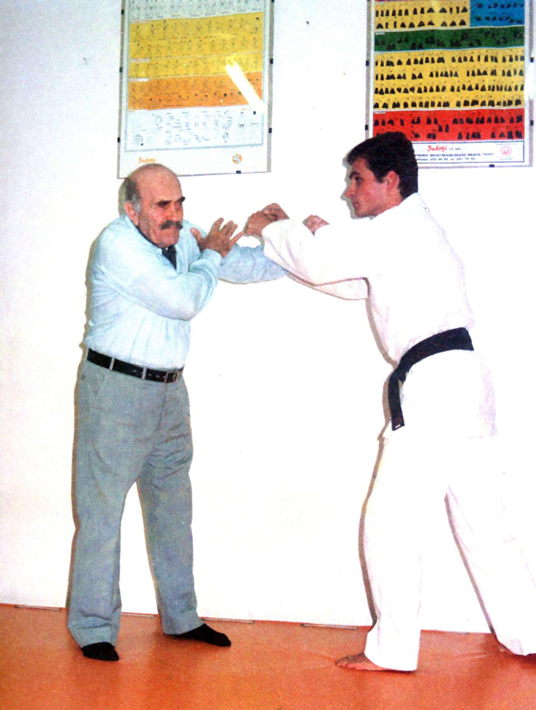
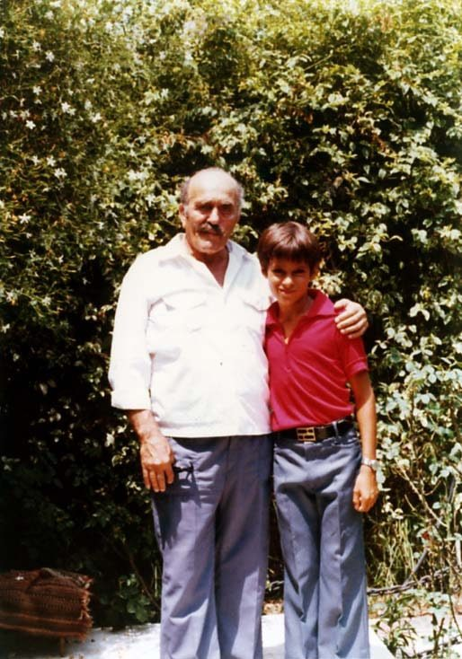
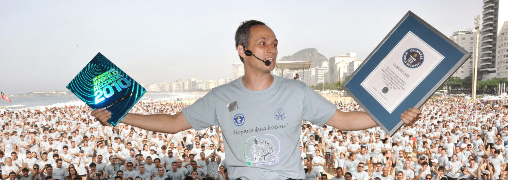
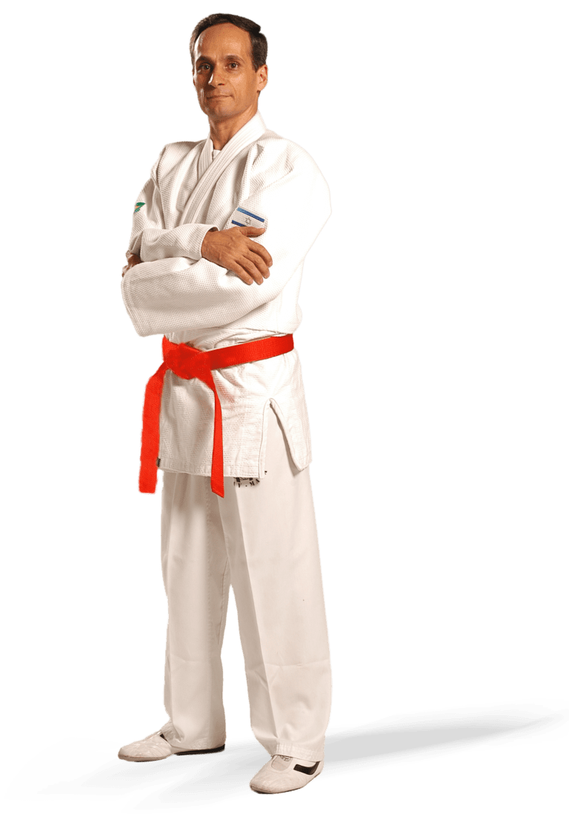

import Image from "next/image";
import {Bleed} from "nextra/components";
import {YouTubeEmbed} from "@next/third-parties/google";

  

  

    

      <h3 className="italic text-lg md:text-xl">
        “O que é Krav Maga para mim?
         É a forma de fazer o mundo melhor.”
      </h3>
      
Grão Mestre Kobi Lichtenstein

    

    

      

        O verdadeiro segredo do nosso sucesso está nas pessoas por trás da tela. E com eles, nossa cultura. Kobi
        Lichtenstein nasceu em 1964, na cidade de Rehovot, Israel. Aos três anos de idade, iniciou-se nos treinamentos
        de Krav Maga ministrados pelo próprio criador da arte, Imi Lichtenfeld (Z”L).
      

      

        Literalmente, aprendeu a socar antes mesmo de aprender a escrever. Sua vida foi dedicada ao Krav Maga, sua
        motricidade e instintos foram moldados pela técnica desta arte e aos 15 anos começou a dar as primeiras aulas.
        Em 1983, Mestre Kobi recebeu a faixa preta de Imi, sendo diplomado como faixa preta pela Associação de Krav Maga
        Israelense e instrutor pela Universidade Wingate, a maior universidade de educação física em Israel. Foi
        responsável pelo ensino de Krav Maga na região centro-sul do País, somando milhares de alunos. Além disso, deu
        aulas a vários grupos específicos, como mulheres vítimas de violência sexual, adolescentes considerados
        delinquentes juvenis, autistas e outros, obtendo resultados surpreendentes e mostrando como o Krav Maga consegue
        mudar a vida das pessoas de forma muito além das técnicas que são ensinadas em aula.
      

    

  

  

    

      

        ## Aluno direto do criador de Krav-Maga
      

    

    

      

        O verdadeiro segredo do nosso sucesso está nas pessoas por trás da tela. E com eles, nossa cultura. Kobi
        Lichtenstein nasceu em 1964, na cidade de Rehovot, Israel. Aos três anos de idade, iniciou-se nos treinamentos
        de Krav Maga ministrados pelo próprio criador da arte, Imi Lichtenfeld (Z”L).
      

      

        Literalmente, aprendeu a socar antes mesmo de aprender a escrever. Sua vida foi dedicada ao Krav Maga, sua
        motricidade e instintos foram moldados pela técnica desta arte e aos 15 anos começou a dar as primeiras aulas.
        Em 1983, Mestre Kobi recebeu a faixa preta de Imi, sendo diplomado como faixa preta pela Associação de Krav Maga
        Israelense e instrutor pela Universidade Wingate, a maior universidade de educação física em Israel. Foi
        responsável pelo ensino de Krav Maga na região centro-sul do País, somando milhares de alunos. Além disso, deu
        aulas a vários grupos específicos, como mulheres vítimas de violência sexual, adolescentes considerados
        delinquentes juvenis, autistas e outros, obtendo resultados surpreendentes e mostrando como o Krav Maga consegue
        mudar a vida das pessoas de forma muito além das técnicas que são ensinadas em aula.
      

    

  

  

  

  ## A diferença entre um Mestre e um Grão Mestre
  

  

    

      

        > Quando cheguei ao Brasil, notei o medo que as pessoas andavam nas ruas e percebi a diferença que o Krav Maga poderia fazer em suas vidas. Então, abracei a missão de ensinar o Krav Maga para cada vez mais pessoas, até que o dia todos entenderam os valores, filosofia e técnicas desta arte. Quando este dia chegar, o Brasil e o mundo não serão mais os mesmos.

      

      

    

  

  

    

      

        ## Grão Mestre Kobi Lichtenstein 
      

    

    

      

        Registros da mídia – imprensa, televisão e rádio – documentam as etapas do trabalho desenvolvido. A difusão e a
        divulgação do Krav Maga na América Latina, desde as primeiras aulas, em clubes e academias, até a fundação da
        Associação Brasileira e posteriormente da Federação Sul Americana, a inauguração do Centro de treinamento
        nacional (Top Defense), os vários cursos em diversos estados brasileiros, o lançamento de 4 livros em língua
        portuguesa, sendo o último lançado também em outras 5 línguas.
      

      

        Como mestre em Krav Maga e especialista em segurança, já ministrou módulos de cursos para diversas entidades
        militares, policiais e de segurança privada. O treinamento para o ramo de segurança tem alcançado excelentes
        resultados e os cursos vêm sendo requisitados em todos os estados brasileiros e por países da América Latina.
        Dentre as principais unidades já treinadas, estão os Comandos Anfíbios e Polícia Federal que atuaram nas
        Olimpíadas Rio 2016 contra possíveis ações terroristas, a segurança pessoal da presidência da República e de
        alguns governadores, Batalhão de Operações Policiais Especiais (BOPE), Forças Especiais (FE) do exército, Centro
        de Instrução de Guerra na Selva (CIGS), etc.
      

    

  

  

  

    <YouTubeEmbed videoid="NNb7iYmZfR4" height={400} width={720} />
  

  

    Em março de 2009, Mestre Kobi foi condecorado com a maior honraria do Estado do Rio de Janeiro, a Medalha Tiradentes. Em maio do mesmo ano, foi condecorado com a maior honraria da cidade do Rio de Janeiro, o conjunto de medalhas Pedro Ernesto. Em dezembro de 2010, recebeu a Medalha Mérito Legislativo no Palácio do Congresso Nacional.

    Em maio de 2010, organizou o maior evento internacional de Krav Maga, trazendo ao Rio de Janeiro os principais mestres de Krav Maga no mundo e reunindo delegações de 28 países durante programação intensa de 5 dias, incluindo seminários, palestras, workshops, evento cultural e noite de homenagens, e ainda obtendo o recorde mundial da “Maior aula de defesa pessoal do mundo”, conferido por auditor oficial do Guinness Records, com 2212 pessoas presentes na aula.

    A grandiosidade do evento colocou o Rio de Janeiro no cenário mundial, elogiado pela hospitalidade e profissionalismo que conduzem o trabalho do Mestre Kobi no Brasil e no mundo nas últimas décadas.

    Ainda em 2010, recebeu o Título de Colaborador Emérito do Exército Brasileiro.

    Em janeiro de 1996, recebeu a faixa preta 6º Dan de Imi, o criador do Krav Maga. Em maio de 2011, recebeu a graduação de honra 8º dan do presidente da Federação Israelense de Krav Maga.

    Hoje, Mestre Kobi é a maior autoridade do Krav Maga na América Latina e uma das maiores do mundo. Através da Federação Sul Americana de Krav Maga, ele comanda e supervisiona os seus instrutores e alunos, sempre com a preocupação de permanecer fiel à obra de Imi, mantendo o alto nível ético e técnico.

  

  

    

    

      
O melhor seguro de vida é saber defender a vida.

    

  

