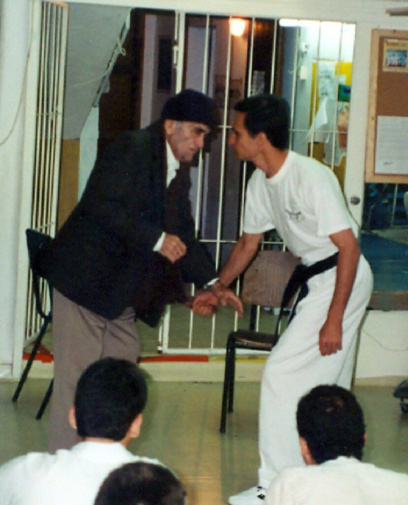

  

    
      # Imi Lichtenfeld
    
    O criador do Krav Maga.
  

  

  Não É Suficiente Fazer Krav Maga.   Deve-Se Entender O Krav Maga.

Um humanista é aquele que, devido ao ambiente ao qual foi exposto, se interessa pelo futuro da humanidade. É aquele que não descansa com os louros conquistados para si e que luta contra a inércia e o comodismo. Afirma e defende que qualquer pessoa pode transcender o ambiente com coragem, porque, em outras palavras, tem liberdade de escolha.

Imi, por toda a vida lutou em guerras e conheceu todas as faces da violência. Enfrentou inimigos, liderou batalhas e mostrou que todos temos a opção de sobreviver à luta, seja ela qual for. Ensinou a homens simples como utilizar o próprio corpo, transformando-os em soldados imbatíveis. A eficácia de seus ensinamentos surpreendeu e sua obra é reconhecida no mundo todo. Sua criação tornou-se a filosofia de defesa do Estado de Israel e de unidades militares de elite ao redor do mundo. O ensino a civis devolve ao cidadão comum a autonomia, mostrando que qualquer um é capaz de se defender de qualquer situação de violência do dia a dia. Imi idealizou, realizou e doou à humanidade seu exemplo, sua postura, seus ensinamentos e sua força: o Krav Maga.

Quem teve o privilégio de conviver com Imi, ouviu frases como essas. Costumava sentar-se com seus alunos em uma cafeteria chamada “Ugati” na cidade de Netanya, Israel, e podia explicar por horas sobre Krav Maga e suas técnicas. Acreditava na essência do ser humano, e que todos podiam ter suas vidas melhoradas pelo caminho de vida correto. Via a vida com simplicidade, recebia a todos com coração aberto e sempre tinha uma mensagem a transmitir. Quem se sentava ao seu lado, percebia imediatamente que se tratava de uma pessoa diferente; iluminada, e com grande força de espírito.
