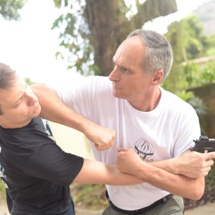
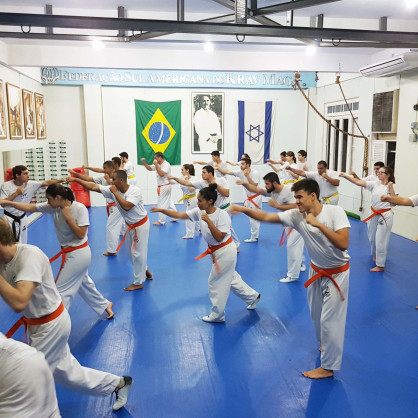
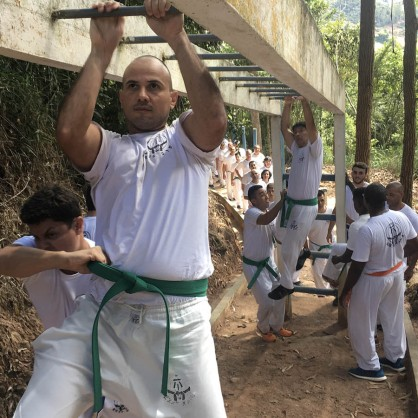
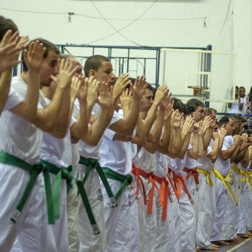

## A Defesa Pessoal do Exército Israelense

Há como se defender de alguém mais forte? E de uma faca, uma arma de fogo, um fuzil? E se forem muitos agressores? Como enfrentar um risco de vida, quando o ataque for incrivelmente desproporcional, é disso que se trata o Krav Maga. Violência de rua é muito diferente de luta esportiva de ringue.

O Krav Maga é a única arte reconhecida mundialmente como arte de defesa pessoal, e não como arte marcial. O seu objetivo é ensinar qualquer pessoa, independente de idade, sexo ou preparo físico, a se defender.

Trazemos respostas para qualquer tipo de agressão, sendo armada ou desarmada; em pé, sentada ou deitada; pela frente, por trás ou pelos lados; contra 1, 2 ou mais agressores. Afinal, quando estamos lidando com a nossa vida, tudo pode acontecer, e não existe o impossível. Por esse motivo, não há regras, juízes ou competições no Krav Maga. Nossa medalha é a nossa integridade física e mental, e a nossa competição é interna, sempre buscando o melhor de nós mesmos.

## A Técnica

  

    As técnicas do Krav Maga são simples, rápidas e objetivas. Elas se baseiam nos movimentos naturais do corpo humano, melhorando as reações que esboçamos naturalmente. Dessa forma, na hora da verdade, quando precisamos reagir sob tensão e medo, torna-se mais fácil realizar as técnicas, já que seria algo bem próximo da reação que faríamos espontaneamente.

    A técnica é baseada na física, matemática e anatomia humana. Utilizamos a força da explosão e a transferência do peso para aumentar a potência dos nossos golpes. Acertamos o alvo com áreas pequenas no nosso corpo para obter uma maior capacidade de penetração. Atingimos pontos do corpo humano com alta concentração de nervos. Alavancas, bloqueios, desvios. Tudo é cientificamente comprovado e explicado a cada aula.

  

  

## As Aulas

  

  

    Tudo começa com um aquecimento, preparando o corpo para a aula que está por vir. Em seguida, o instrutor ensina a técnica, explicando os seus detalhes e a ciência por trás dos movimentos. Então, é a vez do aluno treinar. E isso é feito através de simulações de situações reais, de modo que são simulados ataques e o aluno irá treinar determinada defesa.

    A cada aula, é ensinada uma nova técnica e, aos poucos, o aluno aprende a se defender de diversas agressões que talvez precise enfrentar um dia, como estrangulamentos, agarramentos, socos, chutes, ataques com faca ou outro objetos e até mesmo ameaças com arma de fogo.

  

## Autoconfiança

  

    O treinamento do Krav Maga, além de ensinar as técnicas, desenvolve a autoconfiança e a coragem do aluno. E isso se estende muito além da reação na rua.

    É verdade sim que, aos poucos, perde-se o medo que muitos carregam com si de andar nas ruas. Mas, além disso, perde-se o medo em geral, seja do colega na escola, do chefe no trabalho ou de um desconhecido. E esse é um dos maiores benefícios do Krav Maga: confiar e acreditar mais em si mesmo e na sua própria capacidade.

  

  

## Graduação

  

  

    Tudo começa com um aquecimento, preparando o corpo para a aula que está por vir. Em seguida, o instrutor ensina a técnica, explicando os seus detalhes e a ciência por trás dos movimentos. Então, é a vez do aluno treinar. E isso é feito através de simulações de situações reais, de modo que são simulados ataques e o aluno irá treinar determinada defesa.

    A cada aula, é ensinada uma nova técnica e, aos poucos, o aluno aprende a se defender de diversas agressões que talvez precise enfrentar um dia, como estrangulamentos, agarramentos, socos, chutes, ataques com faca ou outro objetos e até mesmo ameaças com arma de fogo.

  

