import Link from "next/link"
import {Button} from "@/src/components/ui/button"
import {YearSteps} from "@/src/components/YearSteps"
import {cn} from "@/src/lib/utils"
import {GoogleMapsEmbed, YouTubeEmbed} from "@next/third-parties/google"

<h1 className="x:tracking-tight x:text-slate-900 x:dark:text-slate-100 x:font-bold x:mt-2 x:text-4xl">
  Saiu na Mídia
</h1>

  Reportagens, Notícias e outros registros sobre Krav Maga

<YearSteps>

    ## 2019

    ### Krav Maga: O que é?

    <YouTubeEmbed videoid="qqk0F4EKE6o" />

    ## 2017

    ### Mestre Kobi treina Equipe da Novela Apocalipse da Record

    <YouTubeEmbed videoid="KcHHo-BiJ2I" />

    ### Entrevista ReshetTV

    <YouTubeEmbed videoid="Q9FWwKqlDEI" />

    ### Entrevista na ILTV Israel News

    <YouTubeEmbed videoid="QtbemvyP9QY" />

    ## 2016

    ### Entrevista TV Câmara Rio

    <YouTubeEmbed videoid="yWP8uP3ZtW0" />

    ### Curso Antiterror Para As Olimíadas 2016

    <YouTubeEmbed videoid="UEvulyiWHU8" />

    ### Matéria no G1

    
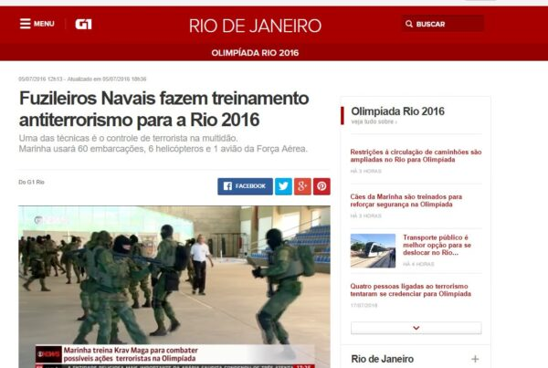

    <Button asChild className="bg-red-700 text-white font-semibold "><Link
    href="https://g1.globo.com/rio-de-janeiro/olimpiadas/rio2016/noticia/2016/07/fuzileiros-navais-fazem-treinamento-antiterrorismo-para-rio-2016.html"
    className="gap-2">Matéria completa no G1.</Link></Button>

    ## Marinha Treina Krav Maga na GloboNews

    
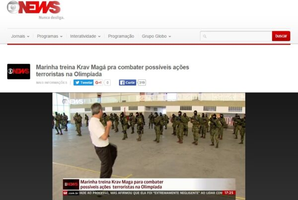

    <Button asChild className="bg-red-700 text-white font-semibold "><Link
    href="https://blogs.oglobo.globo.com/panorama-esportivo/post/marinha-faz-treinamento-de-krav-maga-com-israelense-contra-terrorismo-na-rio-2016.html"
    className="gap-2">Matéria em blog do Globo.</Link></Button>

    ## 2015

    ### Programa da Fátima Bernardes

    <YouTubeEmbed videoid="J2dl_lQ9EdQ" />

    ## 2014

    ### Entrevista em Salvador

    ## 2013

    ### Entrevista em Maceió

    <YouTubeEmbed videoid="4lg0OKPrhLc" />

    ## 2012

    ## Entrevista em Salvador

    <YouTubeEmbed videoid="xBqnGaOH1k8" />

    ### Programa Estrelas com Angélica

    <YouTubeEmbed videoid="Wbpg_kaRJg0" />

    ### Matéria na Bahia

    <YouTubeEmbed videoid="iyGlig3yFsk" />

    ## 2011

    ### O Fluminense

    

    ### Veja Rio

    
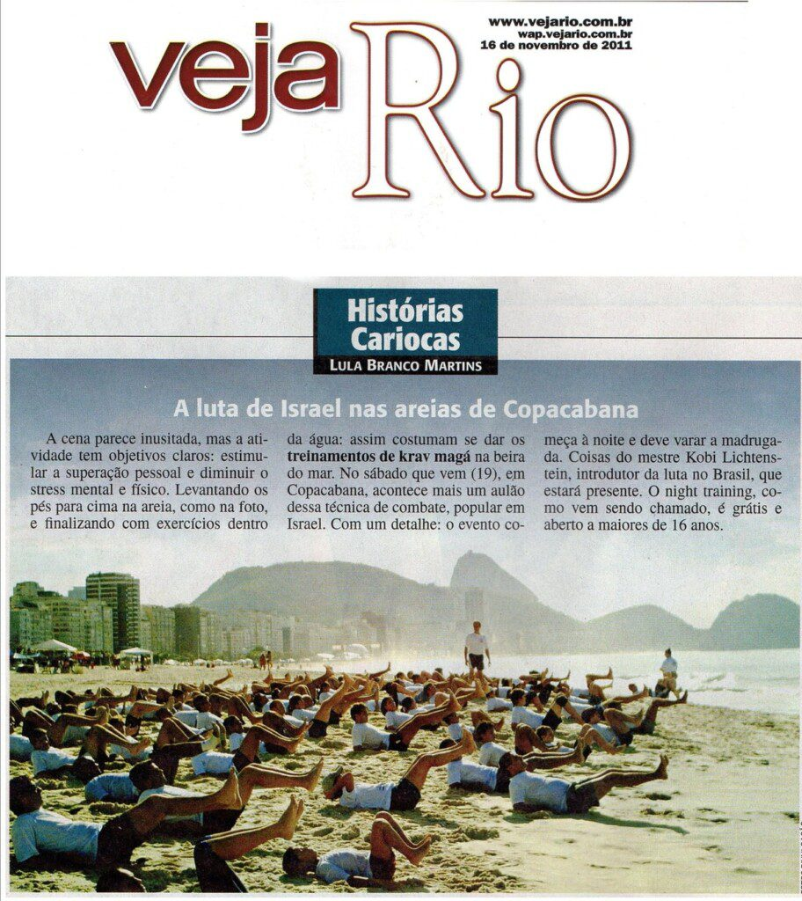

    ### Veja Rio

    
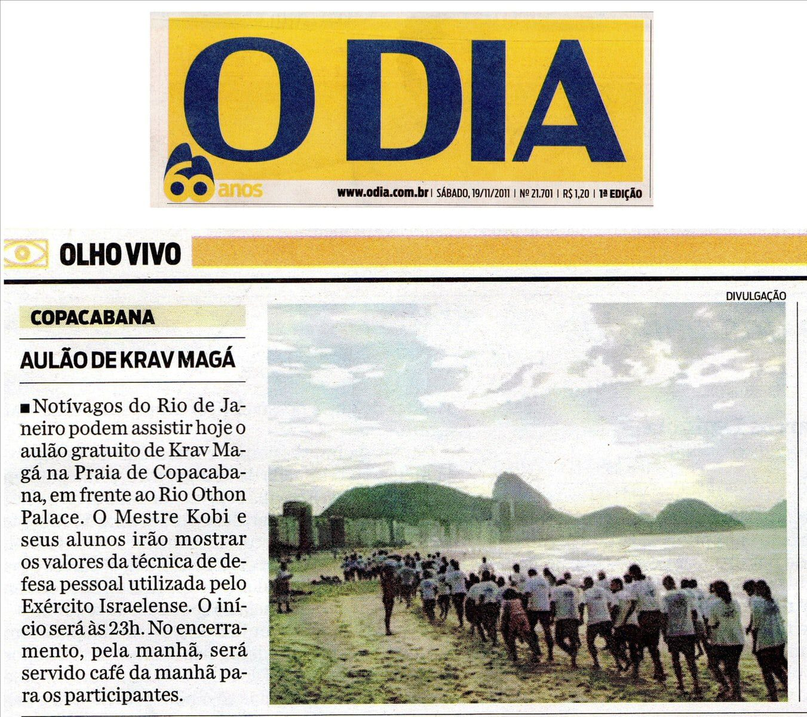

    ## 2010

    ### O Globo

    

    <Button asChild className="bg-blue-900 text-white font-semibold "><Link
    href="https://oglobo.globo.com/politica/segurancas-de-lula-treinam-tecnica-de-defesa-de-israel-para-corpo-corpo-eleitoral-2987855"
    className="gap-2">Matéria completa no O Globo.</Link></Button>

    ### Krav Maga 2010

    
 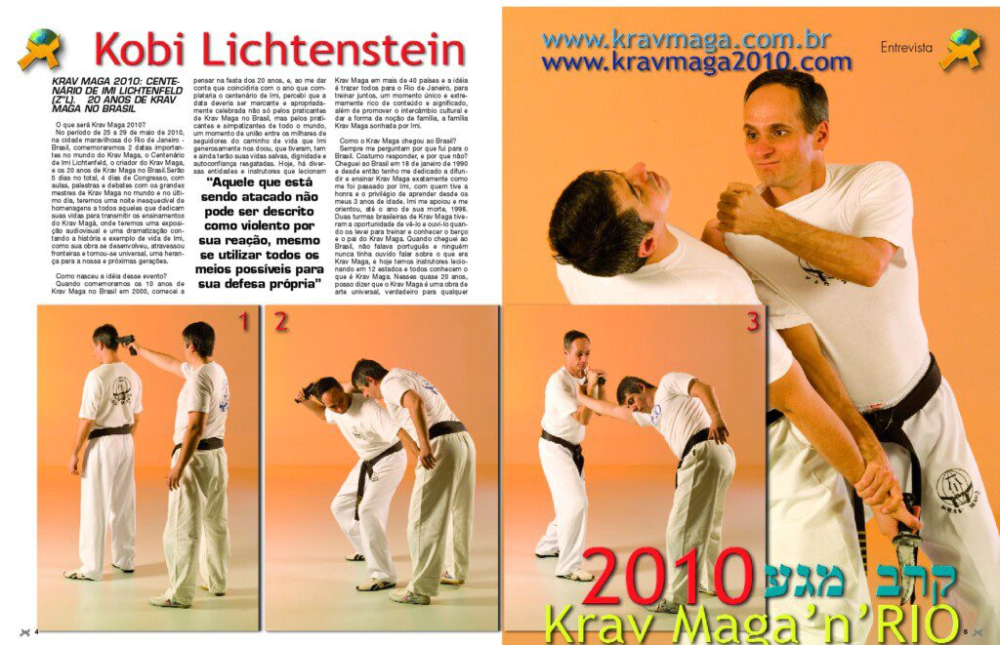 

    ## 2009

    ### Matéria em Manaus

    <YouTubeEmbed videoid="5KDl1TlFHBo" />

    ## 2006

    ### Revista Shalom

    
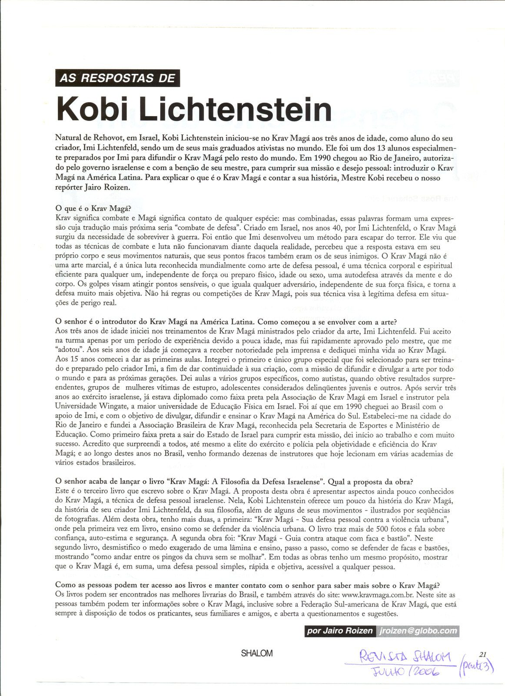

    ## 2004

    ### Mestre Kobi no Jô Soares

    <YouTubeEmbed videoid="hjPzVa8A_6s" />

    ## 2002

    ### Revista Tudo

    
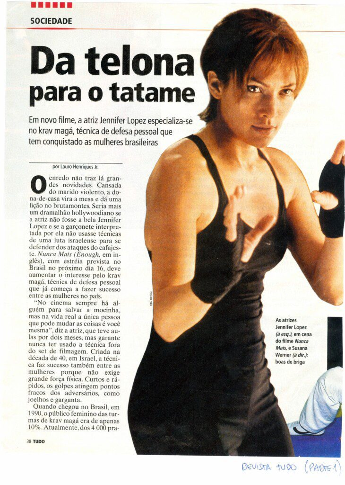

    ## 2001

    ### Extra

    

    ## 1998

    ### Homem De Paz , Professor De Guerra

    

    ### Nota de Falecimento

    

    ### Jornal Guia Fácil

    
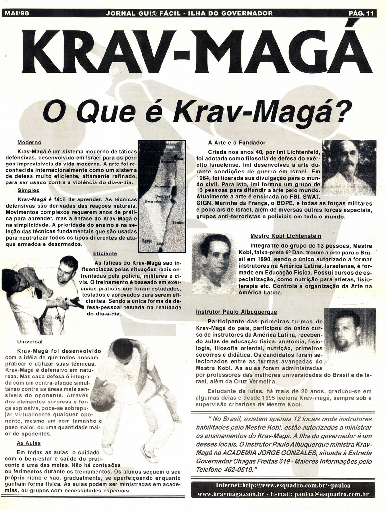

    ## 1996

    ### Zona Sul

    
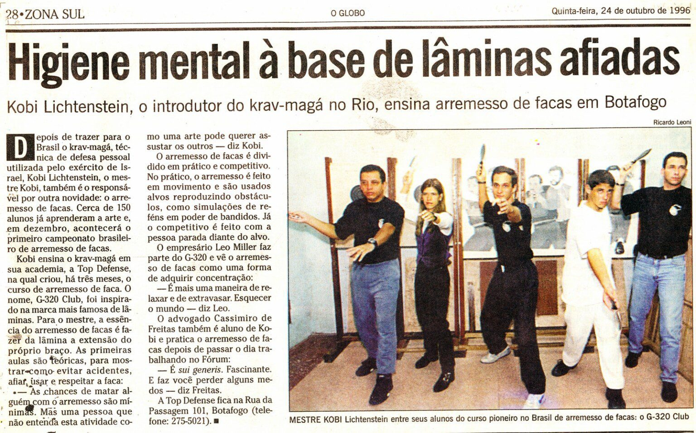

    ## 1995

    ### Jornal do Brasil

    

    ## 1992

    ### Jornal O Globo

    
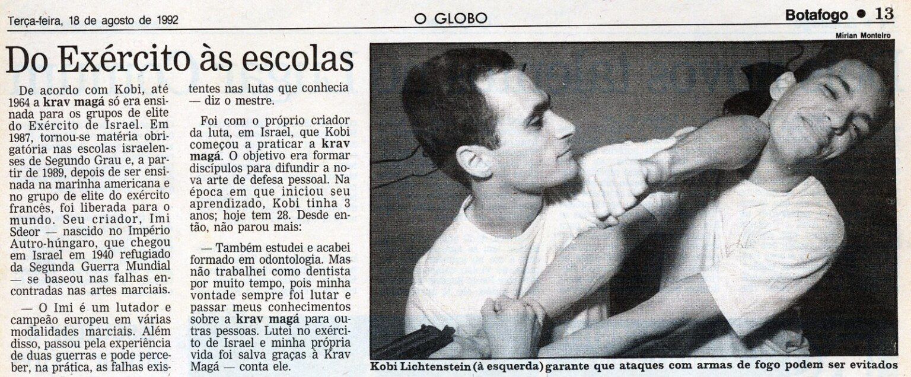

    ## Sem ano

    ### Revista Kiai
    
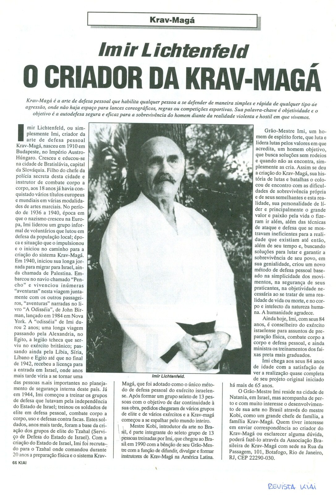

    ### Revista Cinturón Negro

    

    ### Golpes de Mestre

    
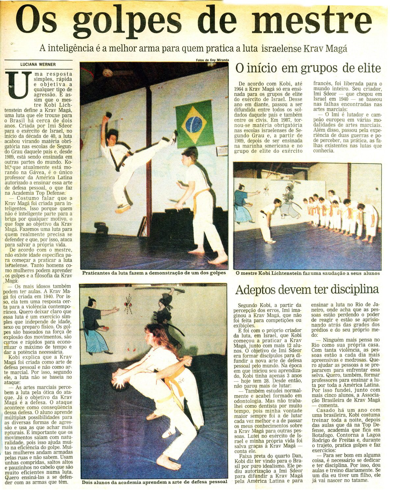

    ### Vale Tudo Mesmo

    

    ### Jornal do Distrito Federal

    
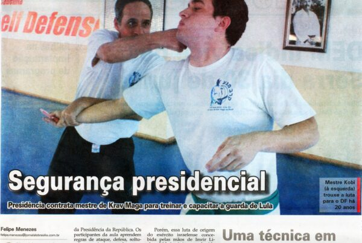

    ### Técnica Israelense

    

    ### Menção em charge do Menino Maluquinho

    

</YearSteps>
